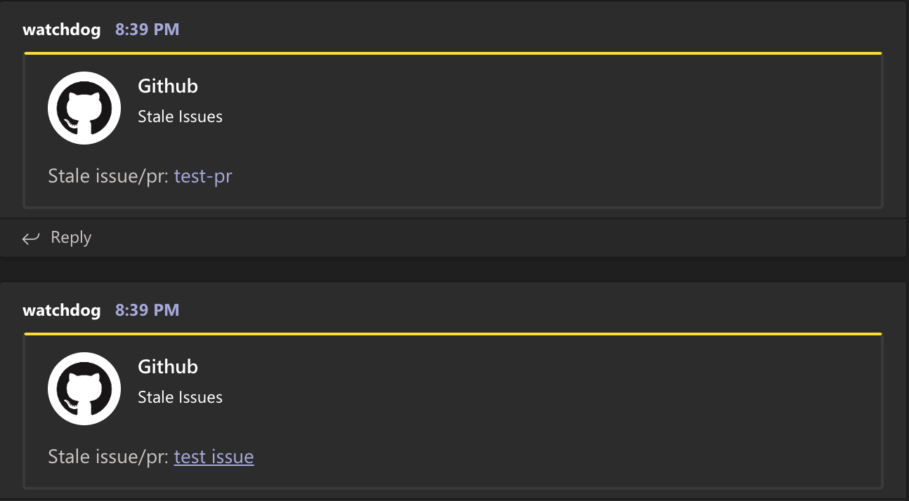

# stale-teams

fork of actions/stale that sends notifications to teams for stale issues/prs.

## usage

```yaml

name: "Stale Teams"

on:
  schedule:
    - cron:  '0 1 * * *'
jobs:
  stale:
    runs-on: ubuntu-latest
    name: A job to check stale prs/issues
    steps:
    - name: Checkout
      uses: actions/checkout@v1
    - name: stale-teams
      id: stale-teams
      uses: rileymichael/stale-teams@v1.0
      with:
        webhook: ${{ secrets.webhook }}
        repo-token: ${{ secrets.GITHUB_TOKEN }}
        days-before-stale: 2

```


